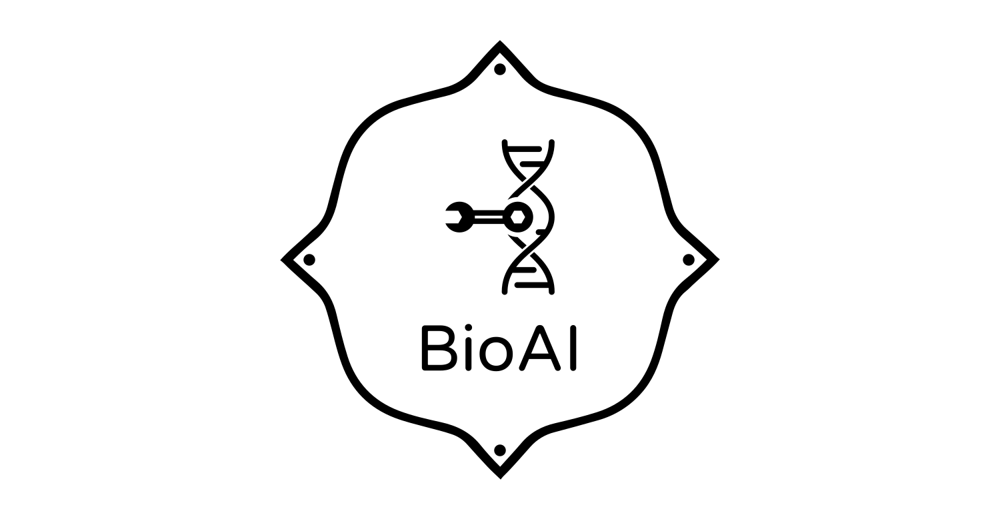

<!-- 

  

 -->

---

## What is BioAI ？

**BioAI** is a library built upon scikit-learn and PyTorch to easily write and train machine learning or deep learning models for biological omics data.  

## What can BioAI do for you ?

## What is the scope of BioAI ?

## How does BioAI work ?

## How to get started ?

## What algorithms are currently supported?

### Data preprocessing

### Machine/Deep learning algorithms

| Algorithm | Paper | 
| --- | ---|
| Random Forest | ?? |
| XGBoost | ?? |

TODO: Introduction 

**BioAI** is a library built upon scikit-learn and PyTorch to easily write and train machine learning or deep learning models for biological omics data.  

It consists of various methods from a variety of published papers. 

[简体中文](https://github.com/BioAI-kits/BioAI/blob/master/README-Zh.md)

--- 

