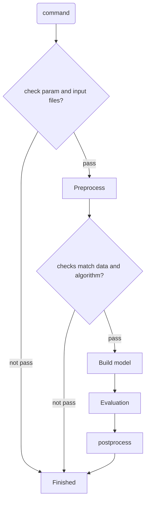

  

---

## Architecture Design

```mermaid
graph TB
    A(command) --> B{check param and input files?}
    
    B{check param and input files?} -- pass --> C[Preprocess]
    B{check param and input files?} -- not pass --> e[Finished]

    C[Preprocess] --> D{checks match data and algorithm?} 

    D{checks match data and algorithm?} -- not pass --> e[Finished]
    D{checks match data and algorithm?} -- pass --> E[Build model]

    E[Build model] --> F[Evaluation]

    F[Evaluation] --> G[postprocess]

    G[postprocess] --> e[Finished]
```

