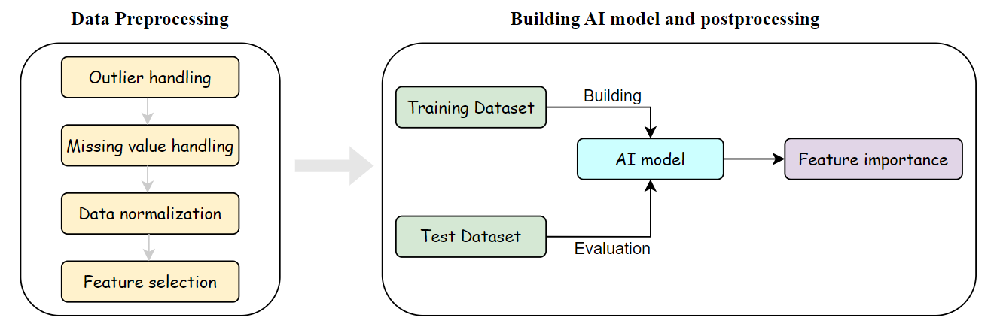

<p align="center">
  
</p>

---

## What is BioAI ？

**BioAI** is a library built upon scikit-learn and PyTorch to easily write and train machine learning or deep learning models for biological omics data and scale data.  Currently, data preprocessing and AI algorithms have been integrated. You can train your own algorithm model directly through the command line. 

---

## What can BioAI do for you ?

If you are a domain scientist (biologist, medical researcher, ...) looking to analyze your own omics or scale data, BioAI provides an out-of-the-box solution that is all but guaranteed to provide excellent results on your individual dataset. Simply convert your dataset into the BioAI format and enjoy the power of AI - no expertise required!

If you are an AI or bioinformatics researcher developing AI algorithms suitable for bioinformatics or clinical practice, BioAI offers the fantastic out-of-the-box applicable baseline algorithms to compete against

Model interpretability is a great concern in the biomedical field, so we have also included AI interpretability algorithms in the new version.

---

## What is the scope of BioAI ?

**BioAI** is designed for fast and easy building of machine/deep learning models for bioinformatics. It can handle arbitrarily formatted omics datasets. 

The methods currently integrated by BioAI are all supervised learning, which means that you need to provide training examples for your application. These methods are all derived from published articles. Collectively, these methods enable **classification** and **regression** tasks such as predicting disease subtypes (classification), predicting generation time (regression).

In terms of data, it supports single-omics and multi-omics integration. Off note, the omics data needs to meet the following structure, that is, each row represents a sample, and each column represents an omics feature, such as a gene or a mutation. An example is as follows:

|            | Gene-A | Gene-B | Gene-C | Gene-D | Gene-E | Gene-F | Gene-G | Gene-H |
| ---        | ---    | ---    | ---    | ---    | ---    | ---    | ---    | ---    |
| patient-1  | 0.01    | 0.01    | 0.01    | 0.01    | 0.01    | 0.01    | 0.01    | 0.01    |
| patient-2  | 0.01    | 0.01    | 0.01    | 0.01    | 0.01    | 0.01    | 0.01    | 0.01    |
| patient-3  | 0.01    | 0.01    | 0.01    | 0.01    | 0.01    | 0.01    | 0.01    | 0.01    |
| patient-4  | 0.01    | 0.01    | 0.01    | 0.01    | 0.01    | 0.01    | 0.01    | 0.01    |
| patient-5  | 0.01    | 0.01    | 0.01    | 0.01    | 0.01    | 0.01    | 0.01    | 0.01    |
| ...  | ...    | ...    | ...    | ...    | ...    | ...    | ...    | ...    |

All data should be saved in `.csv` format, of course you can use `gz` for compression. You can also refer to the [example data](https://github.com/BioAI-kits/BioAI/tree/master/example) we provide for a more intuitive understanding.


---

## How does BioAI work ?

Given a new dataset, BioAI will systematically analyze the provided training cases and create a configurations for each dataset.

In the BioAI framework, the process includes two parts: data preprocessing and model building.  

The data preprocessing adopts common feature engineering steps. After data preprocessing, the data is split into training and testing sets. The training set is used to build the model. Specifically, it includes hyperparameter grid search, model training, and model saving. The test set is used to evaluate the model. Finally, BioAI will calculate the feature importance through the explainability algorithm, so that users can have a deeper understanding of their own models.

<p align="center">
  
</p>

---

## How to get started ?

- **Installation instructions**

We assume that you have installed python version 3.7 or higher. We recommend that you use pypi to install, as follows:

```py
pip install bioai
```

- **An example**


---

## What algorithms are currently supported?

BioAI mainly integrates three types of algorithms: data preprocessing, AI algorithms and interpretability algorithms.

### Data preprocessing


### Machine/Deep learning algorithms

| Algorithm | Scope | Task |Paper | 
| --- | --- | -- | --- | 
| Random Forest | single/multi omics | classification/regression | ?? |
| XGBoost | single/multi omics | classification/regression | ?? |
| SVM | single/multi omics | classification/regression | ?? |
| LASSO | single/multi omics | classification/regression | ?? |
| PathGNN | Transcription | classification | Liang B, Gong H, Lu L, et al. Risk stratification and pathway analysis based on graph neural network and interpretable algorithm[J]. BMC bioinformatics, 2022, 23(1): 394. |
| AttentionMOI | multi omics | classification | ?? |


### Interpretability algorithm


