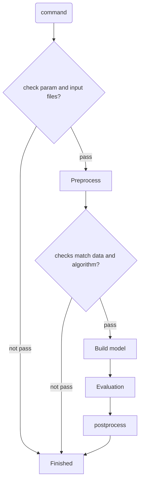

## Architecture Design




## Modules Design

- command：提供命令行接口

- algorithms: 集成开源算法

- check: 提供验证功能

- data: 提供数据下载功能（不断迭代增加）

- evaluation：提供模型评估功能

- preprocessing：提供数据预处理功能

- postprocessing： 提供后处理功能

- trainer：提供模型训练类

- utils：提供其他依赖的功能

- libs：非api，存储一些依赖数据


## 如何定义输入数据格式

- 计算数据：如转录组、突变组

- 依赖数据：如Pathway


## cmd 

- main command ： bioai

- sub cmd: 


## algorithms

任务上分为 `分类` 和 `回归` 算法。

## PyPi

```
python setup.py sdist bdist_egg

twine upload dist/*
```